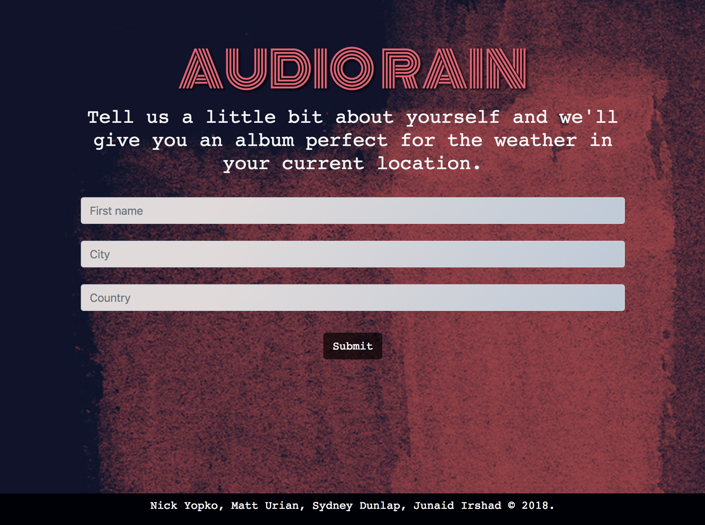
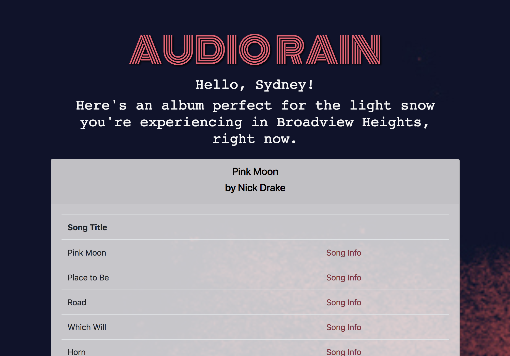
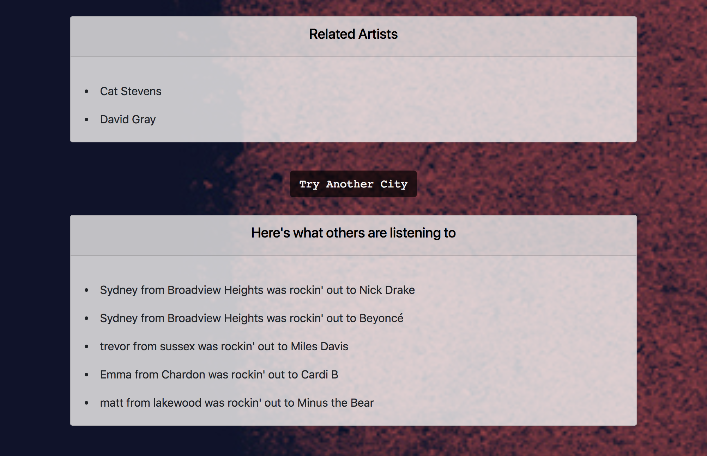

# Audio Rain

This application allows the user to recieve album suggestions based on the weather in their current location. It does this by connecting the weather ID from OpenWeather to a particular mood. Then, we connected the mood to a particular genre or "feeling" of music to suggest an album from MusixMatch.

The user will also get related artists returned to them, as well as, being able to see what album was recommended to the five most recent users prior to their search.

## Technologies Used
- HTML
- CSS
- SASS
- JavaScript
- jQuery
- OpenWeather API
- MusixMatch API
- Firebase

## Project Screenshots & Link to Application
Main Landing Page for Application:

Music Recommendations Based on User Input:

Related Artists & Most Recent Users:

[Click Here to go to Audio Rain](https://syddunlap.github.io/firstgroupproject/)

## Link to Project Presentation
[Google Docs](https://drive.google.com/open?id=1hbmRUJ5rQSP--A3yn6FxNGuB9st07rfD)